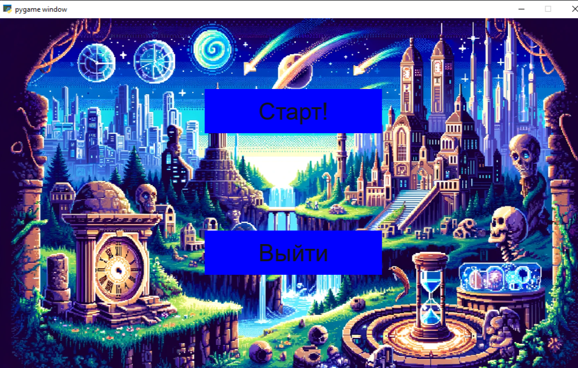
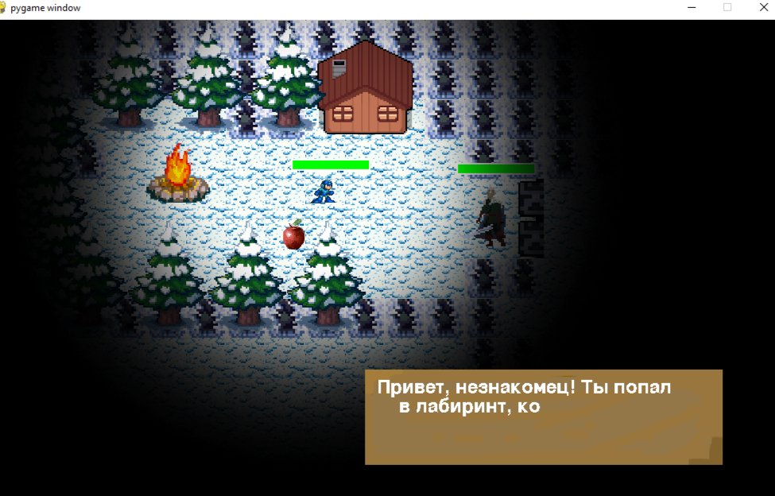
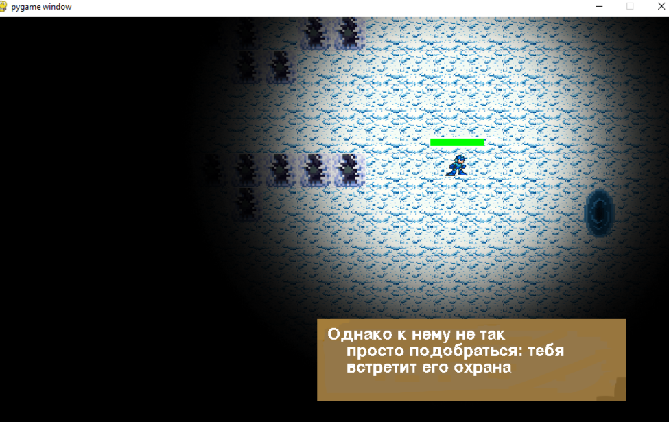
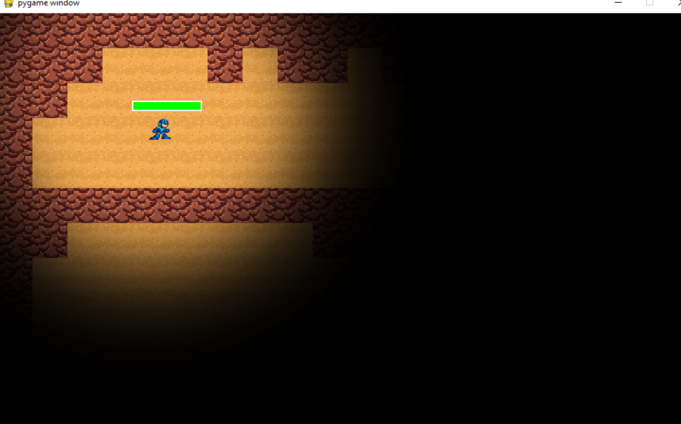
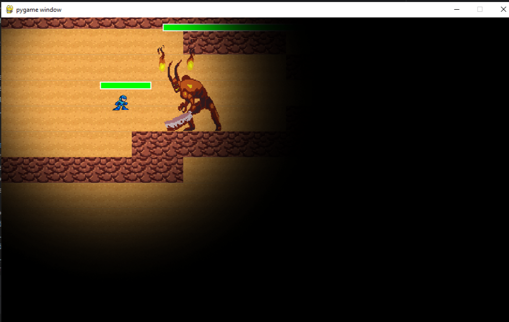
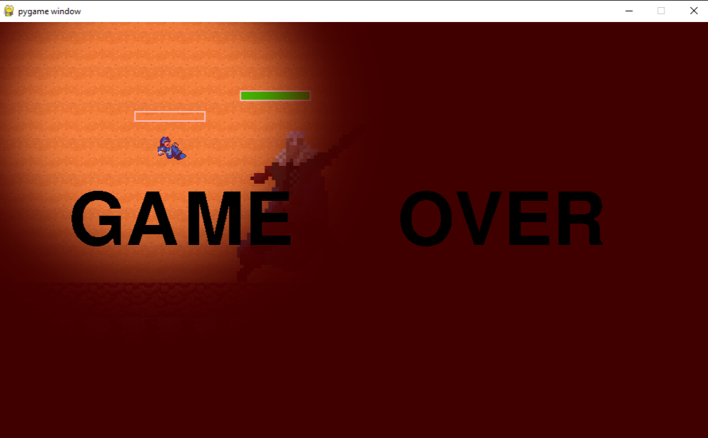
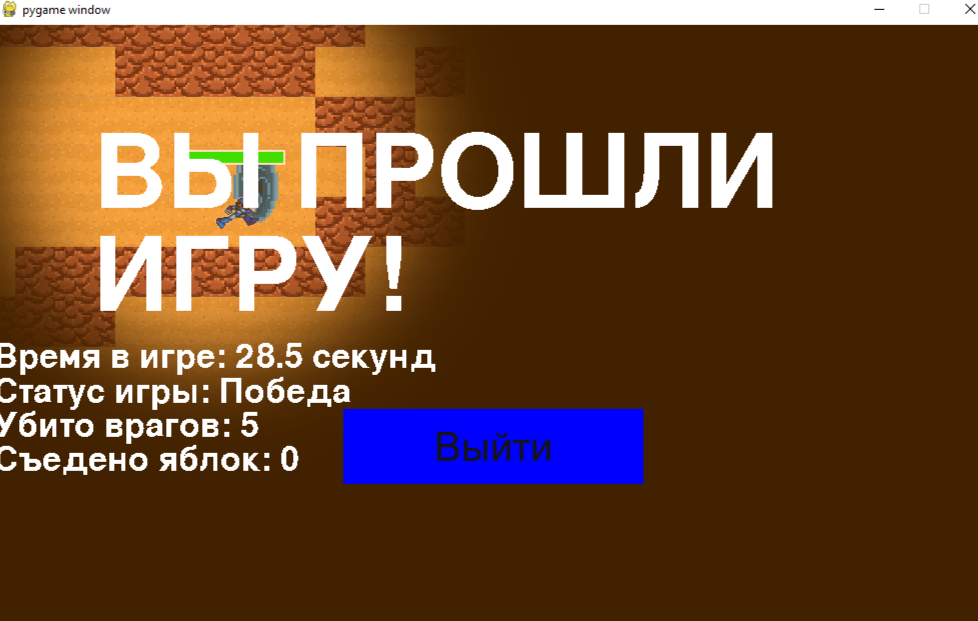
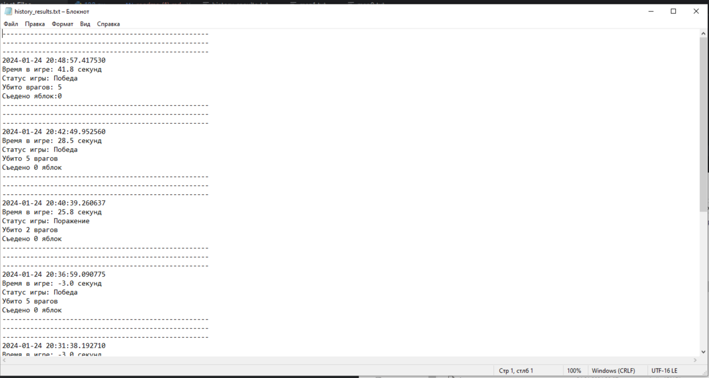

### Name of the project:  
# Игра PyGame


### Кол-во строк в проекте
1247 строки кода в 123.py


### Установка и запуск

Для запуска приложения с использованием интерпретатора python рекомендуется использовать python3.11.
Предварительно необходимо установить все внешние библиотеки.

```sh
$ pip install -r requirements.txt
```

### Процесс работы программы

- Открывается окно, где можно либо начать игру, либо выйти из неё




- После того, как пользователь нажал кнопку старт, запускается игра.




- Итак, небольшое руководство: для передвижения используйте стрелки на клавиатуре, для атаки врагов нужно подойти к ним и нажать либо 
левую кнопку мыши, либо S. Если вы потеряли здоровье, то можете съесть яблоко, которое восстановит его на 30%.
- Суть игры заключается в том, чтобы убить босса, к которому нужно добраться, преодолев врагов, охраняющих двери.
- После убийства первых двух врагов игроку необходимо найти портал, который приведёт его ко второму уровню.




- После того, как игрок нашёл портал, ему необходимо зайти в него.
- Таким образом, он попадёт в следующую локацию



- На этой локации присутствует босс. Осталось лишь найти и убить его!




- Как только мы нашли босса, нам предстоит сразиться с ним. Он гораздо больше и сильнее обычных врагов.



- Если босс убьёт нас, то игра закончится поражением


- Если же мы сможем победить босса, перед нами откроется портал, зайдя в который мы получим сообщение о победе в игре.


- Информация об игровой сессии будет записана в файл history_results.txt.



